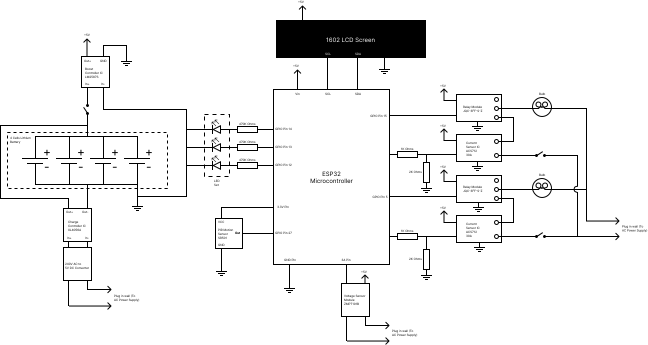

# LAMS - Light Automation Management System

**A web-based IoT solution for centralized remote light control and energy monitoring**

## Overview

LAMS (Light Automation Management System) addresses the challenges of remote light management in modern environments where traditional physical switches require constant physical presence. The system eliminates energy waste from forgotten lights and provides real-time visibility into power consumption patterns.

Built as a full-stack IoT application, LAMS combines a Vue.js frontend with Firebase cloud services to enable users to control multiple lights from any device, monitor energy usage in real-time, and manage access through role-based administration. The system demonstrates effective integration of modern web technologies with IoT hardware, achieving seamless real-time synchronization across all connected devices.

This project serves as both a practical smart home solution and a demonstration of cloud-based IoT architecture suitable for academic research and real-world deployment.

## Features

- **Real-time Light Control**: Instant on/off switching for 2 independent lights with immediate state synchronization across all connected devices
- **Energy Monitoring Dashboard**: Track real-time power consumption in kW/hour with per-light metrics and aggregate usage statistics
- **Multi-user Authentication**: Secure registration, login, and password recovery using Firebase Authentication
- **Role-Based Access Control**: Admin and User roles with differentiated permissions and admin assignment capabilities
- **Custom Light Naming**: User-configurable labels for each light (e.g., "Living Room", "Bedroom")
- **Responsive Web Interface**: Mobile-first design that works seamlessly on desktop, tablet, and mobile browsers
- **User Profile Management**: Editable user information with persistent storage
- **Time-Based Greetings**: Dynamic welcome messages with contextual icons (morning/afternoon/evening)
- **Real-time Data Synchronization**: WebSocket-based Firebase Realtime Database ensures instant updates
- **Cloud-Based Architecture**: No server management required; automatically scales with demand

## Demo

### Application in Action

**Turn on the lights:**

https://user-images.githubusercontent.com/49055048/184628803-a187a091-b7c2-4d06-a5e0-3df9bbfe9669.MP4

---

**Turn off the lights:**

https://user-images.githubusercontent.com/49055048/184629029-484178cb-0939-4c66-b299-0d100a28c418.MP4

---

### Screenshots

**Welcome Screen:**


**Login Screen:**


## Hardware Architecture

The hardware implementation was developed in collaboration with a professional electronics design specialist.

### System Schematic

<div style="background:#f4f6f8;padding:16px;border-radius:8px;display:inline-block;">
    
</div>

### Hardware Components

**Main Controller:**
- ESP32 Microcontroller (WiFi-enabled main processor)

**Power Management:**
- 4-cell Lithium-ion battery (portable power source)
- Boost Controller IC (LM2587S) for voltage regulation
- Charge Controller IC (XL4058A) for battery management
- 240V AC to 5V DC converter for mains power

**Light Control & Sensing:**
- 2× Relay Modules (JQC-3FF-S-Z) for AC light switching
- 2× Current Sensor ICs (ACS712 30A) for real-time energy monitoring
- PIR Motion Sensor for occupancy detection
- Voltage Sensor Module (ZMPT101B) for power measurement

**User Interface:**
- 1602 LCD Screen for local status display
- LED indicators for system feedback

The ESP32 microcontroller interfaces with Firebase Realtime Database to receive light control commands from the web application and report energy consumption data in real-time.

## Technology Stack

**Frontend:**
- Vue.js (JavaScript framework)
- Vuex (state management)
- Vue Router (client-side routing)
- SCSS/SASS (styling)

**Backend & Cloud Services:**
- Firebase 8.7.1
  - Firebase Authentication (user management)
  - Firebase Realtime Database (real-time data sync)
  - Firebase Cloud Functions (serverless admin operations)

## Installation & Setup

### Prerequisites

- Node.js 12.x or higher
- npm 6.x or higher (or yarn 1.22.x)
- Firebase project with Authentication and Realtime Database enabled

### Quick Start

1. **Clone the repository**
   ```bash
   git clone https://github.com/blessedmadukoma/lams-vue.git
   cd lams-vue
   ```

2. **Install dependencies**
   ```bash
   npm install
   # or
   yarn install
   ```

3. **Configure Firebase**

   Create a `.env` file in the project root and add your Firebase credentials:
   ```bash
   cp .env.example .env
   ```

   Edit `.env` with your Firebase project configuration (see `.env.example` for required variables).

4. **Run development server**
   ```bash
   npm run serve
   # or
   yarn serve
   ```

   Application available at `http://localhost:8080`

5. **Build for production**
   ```bash
   npm run build
   # or
   yarn build
   ```

## System Design

LAMS follows a client-server architecture with Firebase as the Backend-as-a-Service (BaaS) provider. The Vue.js single-page application communicates with Firebase services over HTTPS/WebSocket for authentication and real-time data synchronization.

**Data Flow:**
- Users interact with the Vue.js frontend to control lights or view energy metrics
- Firebase Authentication manages user sessions and security tokens
- Firebase Realtime Database stores light states and energy data with automatic synchronization
- ESP32 hardware monitors database changes and controls physical relays accordingly
- Energy consumption data flows from hardware sensors back to Firebase for display in the web UI
- All connected clients receive instant updates through WebSocket connections

## Limitations & Future Work

**Current Limitations:**
- Fixed support for only 2 lights (hardcoded limit)
- Simplified energy metrics (illustrative rather than precision measurements)
- No automation features (scheduling, timers, geofencing)
- Web-only interface (no native mobile apps)
- Limited admin functionality (only role assignment)

**Future Enhancements:**
- Dynamic light management supporting arbitrary number of lights
- Advanced energy analytics with historical graphs and cost calculations
- Automation features: scheduling, scenes, voice assistant integration
- Native iOS and Android applications with push notifications
- Enhanced user management with groups, permissions, and activity logs
- Integration with additional smart home ecosystems (Zigbee, Z-Wave)
- Machine learning for usage predictions and energy optimization

## Contributors

**Author**: Blessed Madukoma
**Contact**: [GitHub Profile](https://github.com/blessedmadukoma)

## Acknowledgments

This project was developed as an undergraduate research initiative exploring IoT integration with modern web technologies. Special thanks to the Vue.js and Firebase communities for their comprehensive documentation, and to the electronics design specialists who contributed to the hardware implementation.

---

**License**: Available for educational and research purposes

**Repository**: [LAMS-Vue on GitHub](https://github.com/blessedmadukoma/lams-vue)
